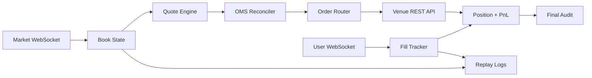

# Matrix Bot v1

**Live-tested CLOB execution infrastructure for prediction markets.**

Matrix Bot v1 is a Go-based execution stack built for Polymarket-style central limit order book markets. It is not a toy "fetch book, place order" script. It is an execution platform with market-data ingestion, order reconciliation, runtime risk controls, post-trade accounting, and audit tooling.

This public repo is a sanitized technical showcase. The private implementation includes the live venue integration, strategy gates, deployment runbooks, and operational tooling.

## At A Glance

| Area | Built |
|---|---|
| Language | Go |
| Market data | WebSocket ingestion, deduplication, freshness checks, replay captures |
| Execution | Signed order flow, open-order reconciliation, cancel/replace loop |
| Risk | Explicit live arming, cancel-only mode, max-fill caps, reduce-only unwind |
| Accounting | User-fill tracking, position sync, realized PnL, final audit |
| Research | Markouts, shadow mode, queue probes, evidence scorecards |
| Public sample | Venue-neutral book, OMS reconciler, latency stats, runnable CLI |

## Why This Is Interesting

Most trading bots are scripts. Matrix Bot v1 was built around the real failure modes of live CLOB execution:

- Market data can be stale.
- Open orders can drift away from current intent.
- Duplicate exposure can happen if reconciliation is sloppy.
- Fills can arrive asynchronously through user streams.
- Local position state can disagree with venue truth.
- A bot needs to stop taking new risk before it tries to flatten.
- Every live session needs a final audit.

The system was designed around those problems from the beginning.

## Runtime Evidence

Measured from runtime/live logs:

| Metric | Observed |
|---|---:|
| Quote diagnostic samples | 16k+ |
| Health samples | 800+ |
| Market WS freshness at health, p50 | ~46 ms |
| User WS freshness at health, p50 | ~35 ms |
| Cancel-all REST latency, p50 | ~31 ms |
| Cancel-all REST latency, p95 | ~46 ms |
| Completed execution-session log entries | 100+ |
| Final audit records | 180+ |
| Final audit drift on clean sessions | 0.000000 |

These are operational measurements from the system's logs. They are not a claim of sub-millisecond end-to-end order execution latency.

## Public Code Included

This repo includes a small, venue-neutral sample of the engineering style:

- `pkg/book`: order book deltas, sorted levels, top-of-book, spread, freshness checks
- `pkg/oms`: deterministic desired-vs-open order reconciliation
- `pkg/latency`: percentile summaries for runtime latency samples
- `cmd/showcase`: runnable CLI tying the samples together
- `docs/ARCHITECTURE.md`: high-level system diagram

Run it locally:

```bash
go test ./...
go run ./cmd/showcase
```

Example output:

```text
Top of book: bid=716 ask=718 spread=2 fresh=true

OMS reconcile plan
- cancel reason=duplicate_or_stale order=ord-1 desired=btc-5m:no:buy
- post   reason=stale_replace order= desired=btc-5m:no:buy
- cancel reason=not_desired order=ord-2 desired=
- post   reason=missing order= desired=btc-5m:yes:sell

Latency sample: count=5 p50=31ms p95=45ms max=46ms
```

## System Design



## Engineering Highlights

### Market Data

- Market WebSocket ingestion
- Book and price-change handling
- Feed freshness checks
- Reconnect tracking
- Deduplication
- Raw capture for replay and analysis

### Execution

- Signed order construction
- Authenticated REST order flow
- Open-order reconciliation
- Cancel/replace loop
- Duplicate-order detection
- Post rejection handling
- Cancel-all safety path

### Risk Controls

- Explicit live arming
- Dry-run and cancel-only modes
- Max fill caps
- Max runtime caps
- No-fill session timeout
- No-new-risk mode after fills
- Reduce-only unwind behavior
- Dust/minimum-order handling
- Shutdown flatten window

### Accounting And Audit

- User WebSocket fill tracking
- Position truth sync
- Realized PnL ledger
- REST-based final audit
- Drift checks between runtime ledger and venue activity
- Session summaries for post-trade review

### Research Tooling

- Markout analysis
- Shadow mode
- Short-duration observer
- Queue-priority probes
- Evidence scorecards
- Replayable JSONL captures

## Access And Collaboration

The full implementation is private. This public repository is only a sanitized technical showcase.

For full access, commercial licensing, technical due diligence, or private walkthroughs, contact the repository owner through GitHub.

I am open to collaboration on new prediction-market infrastructure, execution systems, market-data tooling, and venue integrations.

## Status

Matrix Bot v1 is a historical private-system showcase. Current development focus has moved toward a cleaner multi-venue architecture and Kalshi research.

## Disclaimer

This repository is for technical overview only. It is not financial advice, not a trading recommendation, and not an offer to manage funds. Prediction-market trading involves risk. Users are responsible for complying with all applicable laws, venue rules, and terms of service.
