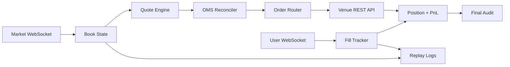

# Architecture

This public diagram shows the shape of the system without exposing private strategy logic, credentials, deployment details, or venue-specific live code.

## Public Code

The code in this repository is intentionally small:

- `pkg/oms`: venue-neutral order reconciliation example
- `pkg/latency`: latency percentile utilities
- `cmd/showcase`: CLI demo of the public components

The private system contains the live venue integration, authenticated signing, strategy gates, deployment runbooks, and operational tooling.
